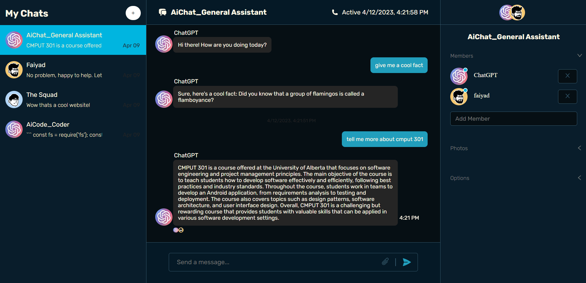
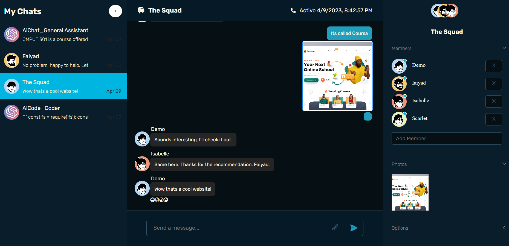

## ChatGPT Chat App

A chat application that lets you chat with others and also directly interact with ChatGPT

Built with Express.js, Node.js, React, ChatEngine, OpenAI API.

## Project Screen Shots





## Project Status
This project is currently in development. Almost all chat functionality is complete. Users can engage in one-on-one or group conversations. Users can also directly prompt ChatGPT from within the conversation

Features currently in progress:
* Automatic summary generation of the conversations
* Auto-identifying important dates from within messages
* Third-party authentication

## Installation and Setup Instructions

Clone down this repository. You will need `node` and `npm` installed globally on your machine.  

You will also need a ChatEngine Account and a new project with a pre-made bot account

#### Client Installation:

```bash
    npm install
```

##### Running the development server.

```bash
    npm run dev
```

##### Building for production.

```bash
    npm run build
```

##### Running the production server.

```bash
    npm run start
````  

#### Server Installation:
You will need to have a MongoDB Atlas database setup and a Cloudinary account
```bash
    npm install
```

##### Adding environment variables
create a .env file and add the following fields:
```
BOT_USER_NAME= [a bot account on ChatEngine that the OpenAI responses will use to send messages]
BOT_USER_SECRET= [the secret for the bot account]
PRIVATE_KEY= [your ChatEngine private key]
PROJECT_ID= [ChatEngine project id]
OPEN_API_KEY= [your OpenAI private key]
```

##### Running the server.

```bash
    npm start
```


## Reflection

This was a small project to gain more experience working with chat applications and also play with the OpenAI API. I learned a ton about how to interact with third-party APIs.

One of the main challenges I ran into was figuring out the ChatEngine prebuilt componants. ChatEngine provides many of the UI componants but it was fun to add my open creative elements to it in order to make it less cookie-cutter. ChatEngine also handles most of the chat functionality but I want to learn more about web sockets and create something similar from scratch.

At the end of the day, the technologies implemented in this project are React, and ChatEngine for the frontend and Express, and Node for the backend. I chose to use ChatEngine because I had to no previous experience with web sockets and I wanted to focus more on the OpenAI integration. In the future I do plan on making something more custom as ChatEngine does have a few limitations.
